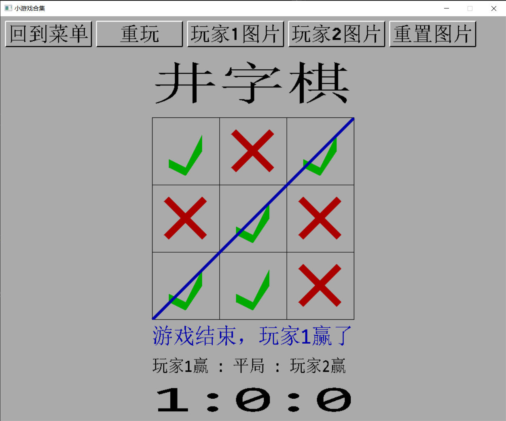
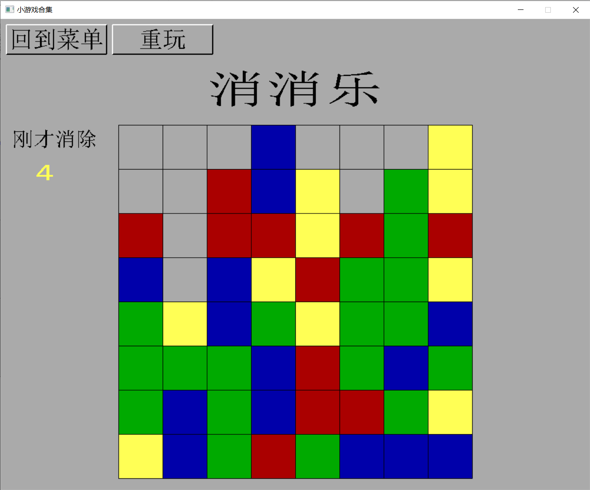
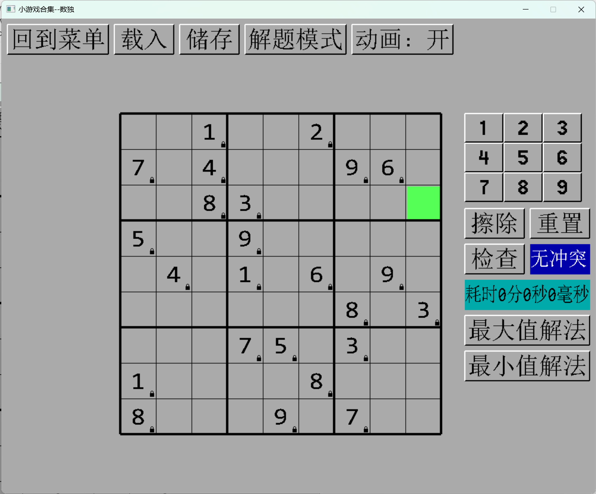
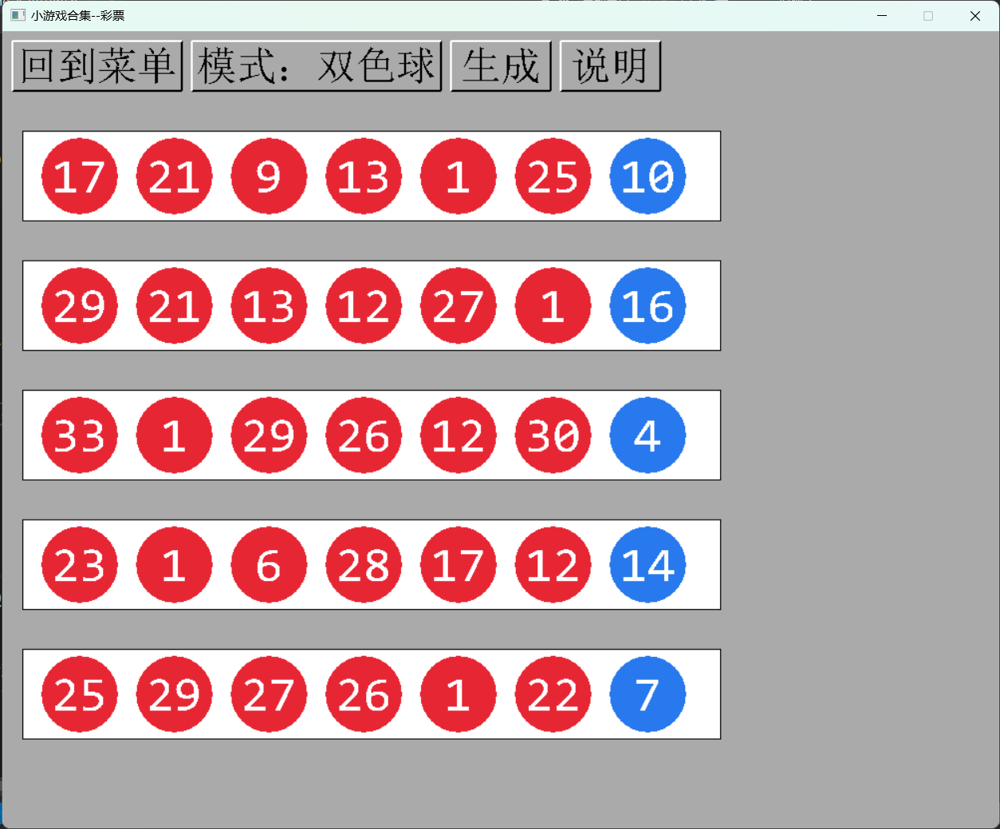
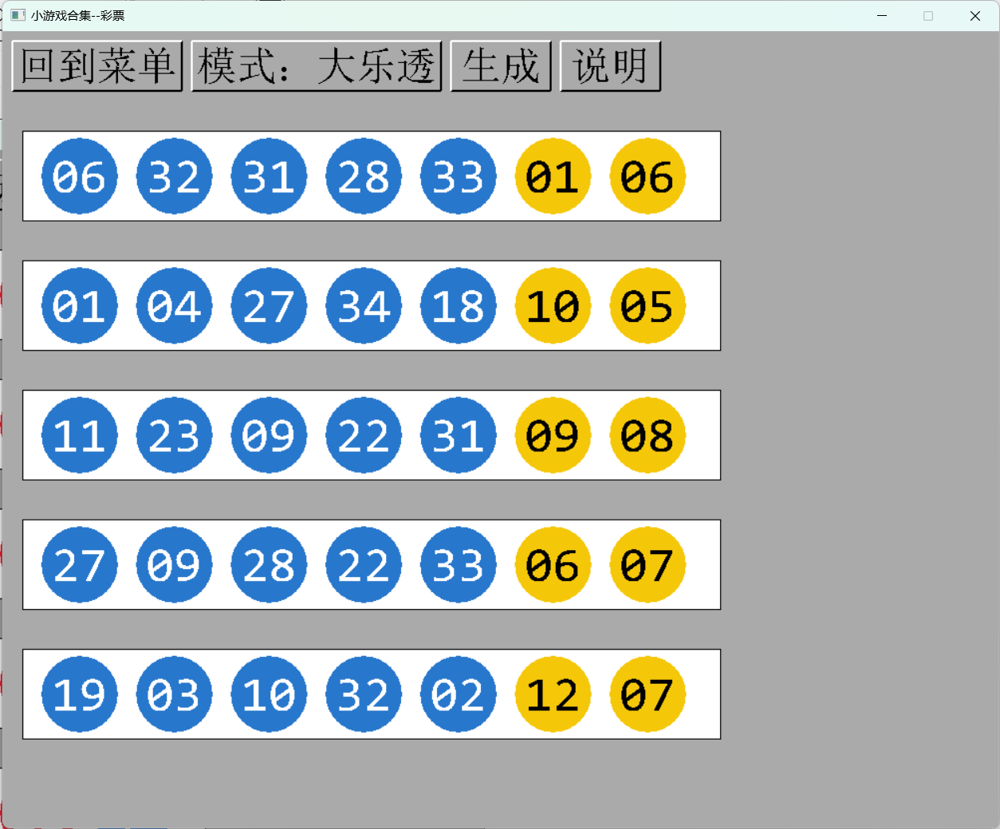
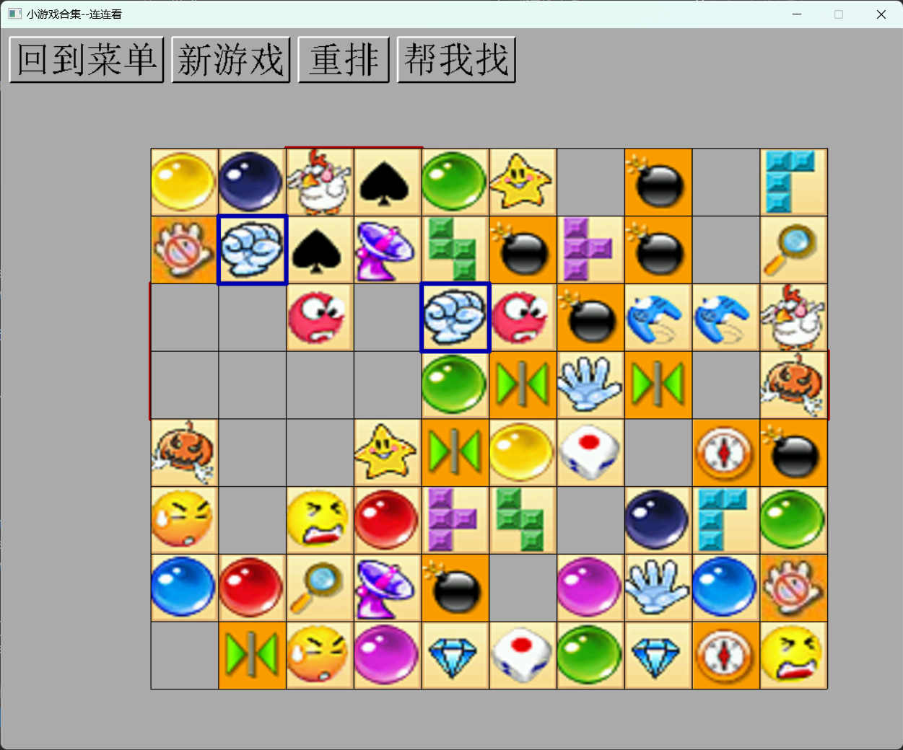
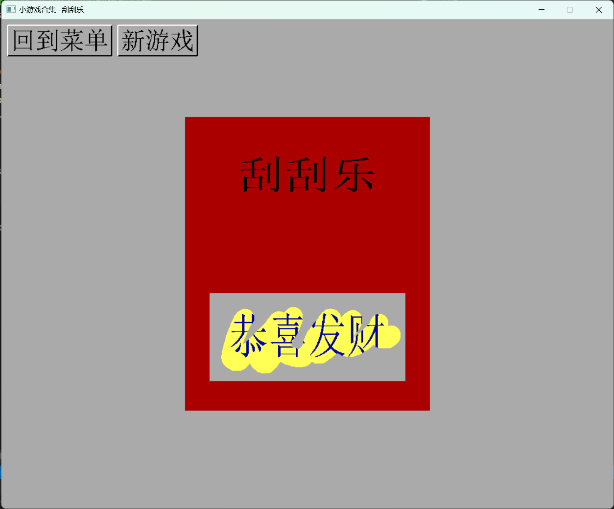

# Collection_of_small_games
## 小游戏合集
当前已实现的小游戏有
- 双人井字棋
- 消消乐
- 数独
- 彩票
- 连连看
- 刮刮乐

## 编译环境
1. 把easyX集成到visual studio中。具体操作可以直接百度搜索easyX，进入官网，有说明
2. 把代码下载到本地，然后使用visual studio 2019（或者更高版本），打开项目目录下的 “小游戏合集.sln 这个文件”
3. 如果直接编译报错，进入visual studio 2019，右键这个项目，进入项目属性页，依次进入 “配置属性-高级-字符集” ，选择 “使用多字节字符集”。即可解决报错问题
4. Frame_5_lianliankan.h引入了多线程，因此需要在visual studio 2019上做以下配置
    1. 下载pthreads-w32-2-9-1-release.zip并解压，解压至任意路径。下载链接：sourceware.org/pub/pthreads-win32/pthreads-w32-2-9-1-release.zip
    2. 假设你压缩包解压后的绝对路径是xxx
    3. 依次点击  项目属性，VC++目录，包含目录，添加绝对路径，例如xxx\pthreads-w32-2-9-1-release\Pre-built.2\include，然后点击 确定，应用。然后你会发现之前报错的#include<pthread.h>已经不报错了
    4. 依次点击  项目属性，VC++目录，库目录，添加绝对路径，例如xxx\pthreads-w32-2-9-1-release\Pre-built.2\lib\x64，然后点击 确定，应用
    5. 依次点击  项目属性，链接器，输入，附加依赖项，添加pthreadVC2.lib。注意，写文件名即可，不用写绝对路径
    6 依次点击  项目属性，C/C++，预处理器，预处理器定义，添加HAVE_STRUCT_TIMESPEC。此步骤是为了解决“timespec”:“struct”类型重定义的报错
    7 在pthreads-w32-2-9-1-release包的x64目录里里面找到pthreadVC2.dll，复制粘贴至C:\Windows\System32\。此步骤是为了解决找不到pthreadVC2.dll的报错

## 另外的说明
1. 如果github的网页上显示不了图片，用这个链接里的方法试一试 https://cloud.tencent.com/developer/article/2072525
2. 新建的文件在git上传的时候，如果发现中文乱码了，解决方法是：vs2019中选中并打开乱码的文件，点击菜单栏的“文件”，点击“高级保存选项”，选择“Unicode(UTF-8带签名)65001”，然后保存即可。